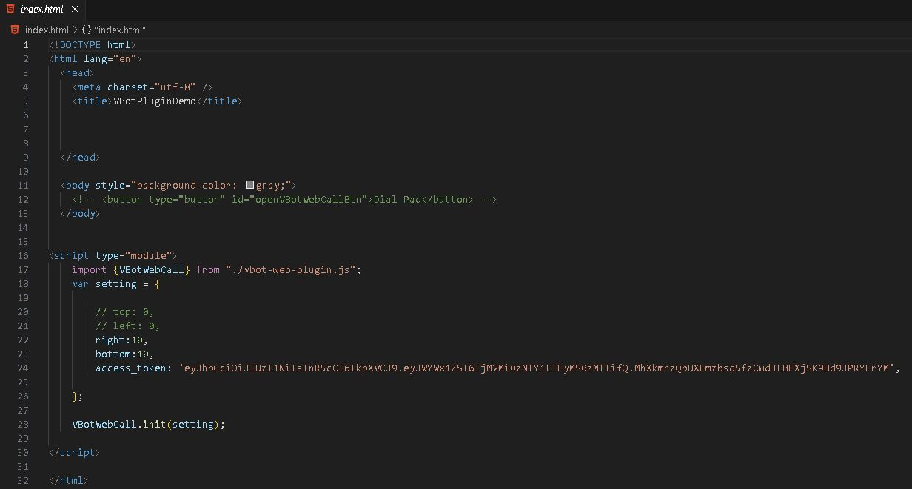

# VBot plugin docs

> VBot Web Plugin được xây dựng theo ngôn ngữ HTML CSS và Javascript, bao gồm giao diện bàn phím quay số, màn hình cuộc gọi và danh sách lịch sử cuộc gọi
> 

## Nhúng VBotWebPlugin vào trang HTML

Thêm đoạn code sau vào bên dưới thẻ **<body></body>** của trang HTML:

```html
<script type="module">
    import {VBotWebCall} from "https://plugin.vbot.vn/v1.0/vbot-web-plugin.js";
    var setting = {
        
        // top: 0,
        // left: 0,
        right:0,
        bottom:0,
        access_token: ‘YOUR ACCESS TOKEN’
    };
    
    VBotWebCall.init(setting);
  
</script>

```

## Trong đó:

- top: Khoảng cách (px) tới lề trên của page, tương tự top của CSS
- bottom: Khoảng cách (px) tới lề dưới của page, tương tự bottom của CSS
- right: Khoảng cách (px) tới lề phải của page, tương tự right của CSS
- left: Khoảng cách (px) tới lề trái của page, tương tự left của CSS
- access_token: Token của tài khoản SDK, vui liên hệ hỗ trợ VBot để được hướng dẫn đăng ký tài khoản SDK và lấy token

b. Tạo nút mở chức năng call:

- Tạo thẻ <button type = ”button”></button> trên trang HTML
- Gán id =”openVBotWebCallBtn” cho thẻ button vừa tạo
- <button type = “button” id=” openVBotWebCallBtn”>Gọi điện</button>
```jsx
<!DOCTYPE html>
<html lang="en">
  <head>
    <meta charset="utf-8" />
    <title>VBotPluginDemo</title>
    
    
    
  </head>

  <body style="background-color: gray;">
    <!-- <button type="button" id="openVBotWebCallBtn">Dial Pad</button> -->
  </body>
  
 
<script type="module">
    import {VBotWebCall} from "https://plugin.vbot.vn/v1.0/vbot-web-plugin.js";
    var setting = {
        
        // top: 0,
        // left: 0,
        right:10,
        bottom:10,
        access_token: ‘YOUR ACCESS TOKEN’,

    };
   
    VBotWebCall.init(setting);
      
</script>
 
</html>

```
<!--  -->

## Tùy chỉnh vị trí bàn phím quay số

- Có thể tùy chỉnh vị trí bàn phím số trên giao diện web của bạn bằng cách chỉnh giá trị các tham số top, bottom, left, right khi gọi hàm setting trong lúc nhúng plugin. Nếu giá trị không xác định thì mặc định sẽ ưu tiên top và left.
- Gọi hàm VBotWebCall.init(setting); để truyền tham số cấu hình vào plugin.

## Các sự kiện

### a.Kết nối với máy chủ VBot

VBotWebCall.client = await VBotClient(VBotWebCall.access_token);

VBotWebCall.client.connect();

### b.Lấy danh sách hotline

VBotWebCall.client.getHotlines();

### c.Các sự kiện của cuộc gọi

- Thực hiện cuộc gọi:

```jsx
VBotWebCall.client.invite(phone, hotline).catch();
```

- Hủy cuộc gọi đi:

```jsx
VBotWebCall.session.cancel();
```

- Lắng nghe sự kiện cuộc gọi đến:

```jsx
VBotWebCall.client.on('invite', async (session) => {
	//your code
});
```

- Chấp nhận cuộc gọi đến:

```jsx
VBotWebCall.session.accept();
```

- Từ chối cuộc gọi đến:

```jsx
VBotWebCall.session.reject();
```

- Giữ máy:

```jsx
VBotWebCall.session.hold();
```

- Hủy giữ máy:

```jsx
VBotWebCall.session.unhold();
```

- Tắt cuộc gọi (hang up):

```jsx
VBotWebCall.session.terminate();
```

- Tắt/Bật micro:

```jsx
VBotWebCall.session.media.input.muted = true; // tắt mic

VBotWebCall.session.media.input.muted = false; // bật mic
```

- Lắng nghe trạng thái cuộc gọi:

```jsx
VBotWebCall.client.on("statusUpdate", function (status) {
	//your code
});
```

- Gửi DTMF:

```jsx
VBotWebCall.session.dtmf(dtmfNumber);
```

- Cấu hình thiết bị thu/phát:

```jsx
VBotWebCall.client.defaultMedia.input.id = deviceId;

VBotWebCall.client.defaultMedia.output.id = deviceId;
```